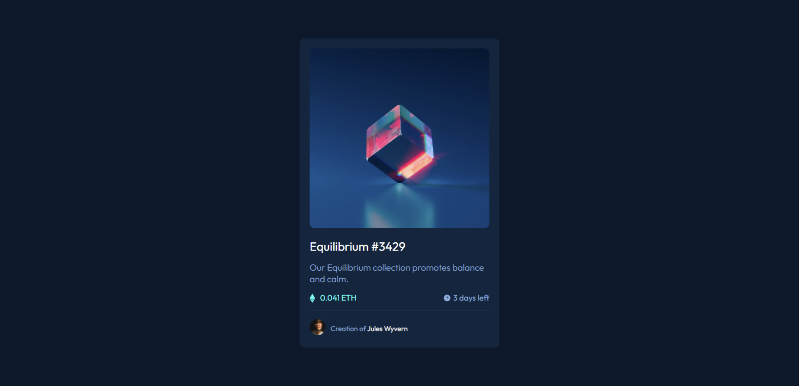

# Frontend Mentor - NFT preview card component solution

This is a solution to the [NFT preview card component challenge on Frontend Mentor](https://www.frontendmentor.io/challenges/nft-preview-card-component-SbdUL_w0U). Frontend Mentor challenges help you improve your coding skills by building realistic projects.

## Table of contents

- [Frontend Mentor - NFT preview card component solution](#frontend-mentor---nft-preview-card-component-solution)
  - [Table of contents](#table-of-contents)
  - [Overview](#overview)
    - [The challenge](#the-challenge)
    - [Screenshot](#screenshot)
    - [Links](#links)
  - [My process](#my-process)
    - [Built with](#built-with)
    - [What I learned](#what-i-learned)
  - [Author](#author)

**Note: Delete this note and update the table of contents based on what sections you keep.**

## Overview

### The challenge

Users should be able to:

- View the optimal layout depending on their device's screen size
- See hover states for interactive elements

### Screenshot



### Links

- Solution URL: [github.com/Opeyemi-stack/nft-preview-card-component-main](https://github.com/Opeyemi-stack/nft-preview-card-component-main)
- Live Site URL: [nft-preview-card-component-main-phi-ten.vercel.app/](https://nft-preview-card-component-main-phi-ten.vercel.app/)

## My process

### Built with

- Semantic HTML5 markup
- CSS custom properties
- Flexbox
- CSS BEM Methodology
- Mobile-first workflow

**Note: These are just examples. Delete this note and replace the list above with your own choices**

### What I learned

I learnt the use of :hover and ::before psuedo element in css to create an overlay effect on the card image.

```html
<div class="card__img-wrapper">
  
</div>
```

```css
.card__img-wrapper {
  position: relative;
}

.card__img-wrapper:hover::before {
  content: " ";
  width: 100%;
  height: 100%;
  position: absolute;
  top: 0;
  left: 0;
  background: hsla(178, 100%, 50%, 0.548) url(images/icon-view.svg) center no-repeat;
  cursor: pointer;
  border-radius: 10px;
}
```

## Author

- Website - [Obatola Opeyemi](https://github.com/Opeyemi-stack)
- Frontend Mentor - [@Opeyemi-stack](https://www.frontendmentor.io/profile/opeyemi-stack)
- Twitter - [@opeyemi_obatola](https://www.twitter.com/Opeyemi_obatola)
